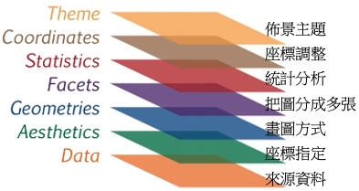

```{r setup, include=FALSE}
knitr::opts_chunk$set(echo = TRUE)
```

## About ggplot2

ggplot2 is a system for declaratively creating graphics, based on The Grammar of Graphics. You provide the data, tell ggplot2 how to map variables to aesthetics, what graphical primitives to use, and it takes care of the details.

[ggplot2 cheatsheet](https://github.com/rstudio/cheatsheets/blob/main/data-visualization.pdf)

## Grammar of Graphics

### Dataset to plot

We use the below dataset to explain the ggplot usage.

```{r}
library(datasets)
data(iris)
iris
```

### ggplot layers

The ggplot graphics grammar can be understood via layers as shown below.



Below is the ggplot code with colors matching the corresponding layers, respectively. In the following context, we will show how the plot becomes when layers are added one-by-one.

<div style="font-family: monospace">
ggplot(<span style="color: #ED8D5A;">iris</span>, <span style="color: green;">aes(x = Sepal.Length, y = Sepal.Width)</span>) +<br>
<span style="color: blue;"   > geom_jitter(alpha = 0.6)</span> + <br>
<span style="color: purple;" > facet_grid(. ~ Species)</span> +  <br>
<span style="color: red;"    > stat_smooth(method = "lm", se = F, col = "red")</span> + <br>
<span style="color: brown;"  > scale_y_continuous("Sepal Width (cm)", limits = c(2,5), expand = c(0,0))</span> + <br>
<span style="color: brown;"  > scale_x_continuous("Sepal Width (cm)", limits = c(4,8), expand = c(0,0))</span> + <br>
<span style="color: brown;"  > coord_equal()</span> +                              <br>
<span style="color: #F7B36F;"> theme(panel.background = element_blank(),           </span><br>
<span style="color: #F7B36F;">&nbsp;&nbsp;&nbsp;&nbsp;&nbsp; plot.background = element_blank(),           </span><br>
<span style="color: #F7B36F;">&nbsp;&nbsp;&nbsp;&nbsp;&nbsp; legend.background = element_blank(),         </span><br>
<span style="color: #F7B36F;">&nbsp;&nbsp;&nbsp;&nbsp;&nbsp; legend.key = element_blank(),                </span><br>
<span style="color: #F7B36F;">&nbsp;&nbsp;&nbsp;&nbsp;&nbsp; strip.background = element_blank(),          </span><br>
<span style="color: #F7B36F;">&nbsp;&nbsp;&nbsp;&nbsp;&nbsp; axis.text = element_text(colour = "black"),  </span><br>
<span style="color: #F7B36F;">&nbsp;&nbsp;&nbsp;&nbsp;&nbsp; axis.ticks = element_line(colour = "black"), </span><br>
<span style="color: #F7B36F;">&nbsp;&nbsp;&nbsp;&nbsp;&nbsp; panel.grid.major = element_blank(),          </span><br>
<span style="color: #F7B36F;">&nbsp;&nbsp;&nbsp;&nbsp;&nbsp; panel.grid.minor = element_blank(),          </span><br>
<span style="color: #F7B36F;">&nbsp;&nbsp;&nbsp;&nbsp;&nbsp; axis.line = element_line(colour = "black"),  </span><br>
<span style="color: #F7B36F;">&nbsp;&nbsp;&nbsp;&nbsp;&nbsp; strip.text = element_blank())                </span><br>
</div>

### Data + Aesthetics

```{r}
library(ggplot2)
ggplot(iris, aes(x = Sepal.Length, y = Sepal.Width))
```

### Data + Aesthetics + Geometries

```{r}
ggplot(iris, aes(x = Sepal.Length, y = Sepal.Width)) +
  geom_jitter(alpha = 0.6)
```

### Data + Aesthetics + Geometries + Facets

```{r}
ggplot(iris, aes(x = Sepal.Length, y = Sepal.Width)) +
  geom_jitter(alpha = 0.6) +
  facet_grid(. ~ Species)
```

### Data + Aesthetics + Geometries + Facets + Statistics

```{r}
ggplot(iris, aes(x = Sepal.Length, y = Sepal.Width)) +
  geom_jitter(alpha = 0.6) +
  facet_grid(. ~ Species) +
  stat_smooth(method = "lm", se = F, col = "red")
```

### Data + Aesthetics + Geometries + Facets + Statistics + Coordinates

```{r}
ggplot(iris, aes(x = Sepal.Length, y = Sepal.Width)) +
  geom_jitter(alpha = 0.6) +
  facet_grid(. ~ Species) +
  stat_smooth(method = "lm", se = F, col = "red") +
  scale_y_continuous("Sepal Width (cm)", limits = c(2,5), expand = c(0,0)) +
  scale_x_continuous("Sepal Width (cm)", limits = c(4,8), expand = c(0,0)) +
  coord_equal()
```

### Data + Aesthetics + Geometries + Facets + Statistics + Coordinates + Theme

```{r}
ggplot(iris, aes(x = Sepal.Length, y = Sepal.Width)) +
  geom_jitter(alpha = 0.6) +
  facet_grid(. ~ Species) +
  stat_smooth(method = "lm", se = F, col = "red") +
  scale_y_continuous("Sepal Width (cm)", limits = c(2,5), expand = c(0,0)) +
  scale_x_continuous("Sepal Width (cm)", limits = c(4,8), expand = c(0,0)) +
  coord_equal() +
  theme(panel.background = element_blank(),
        plot.background = element_blank(),
        legend.background = element_blank(),
        legend.key = element_blank(),
        strip.background = element_blank(),
        axis.text = element_text(colour = "black"),
        axis.ticks = element_line(colour = "black"),
        panel.grid.major = element_blank(),
        panel.grid.minor = element_blank(),
        axis.line = element_line(colour = "black"),
        strip.text = element_blank()
        )
```
